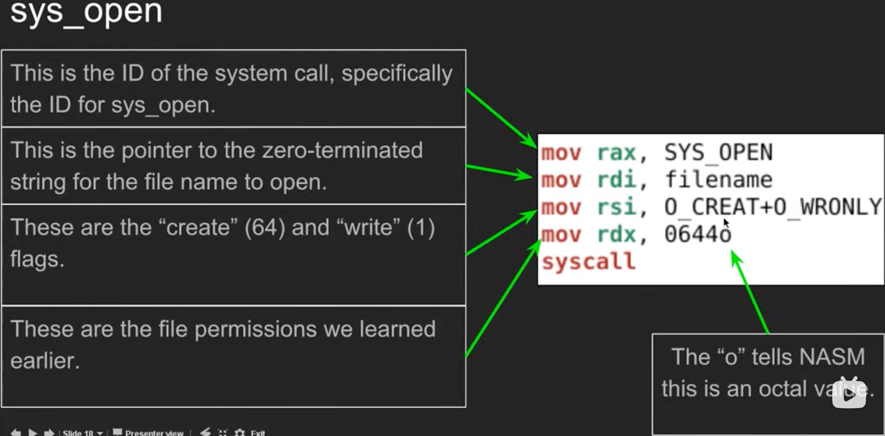
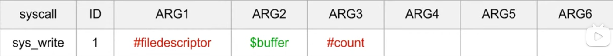

# 目标
## 熟练使用 Linux 下 X86-64 汇编开发，大概了解即可，需要用到再查询
## 需要对汇编转换为字节码时直接参考 nasm 编码后的文件反编译即可，遇到一个写一个就行了

readelf -h xxx 获取对应 elf 文件的文件头信息<br>
<br>
readelf -l xxx 获取对应 elf 文件的程序头信息<br>
<br>
可以借助二进制查看器，根据文件头信息与程序头信息查看对应数据<br>
<br>
objdump -d xxx 获取对应 elf 文件的反汇编信息<br>
<br>
test elf 文件详解（test 文件夹下）<br>
## Linux 汇编使用
```shell
nasm -f elf64 -o xxx.o xxx.asm # 汇编
ld xxx.o -o xxx # 链接
chmod 777 xxx # 添加执行权限
```
## 可用的寄存器

## 系统调用参数寄存器
<br>
看到 ID 应该就知道怎么回事了<br>

```nasm
mov rax,1
mov rdi,1
mov rsi,text
mov rdx,14
syscall
```
上图是以 sys_write 为例
<br>
sys_exit 系统调用
## 常用 Flag

## 指针寄存器

rxx 存储着 xx 的地址
## 常见的跳转条件

## 算数操作

## 栈操作
<br>
注意这里 rsp 是栈顶指针，[] 取值
## 文件函数




注意 ARG1 是文件描述符


## Sleep

ARG2 通常直接使用 0